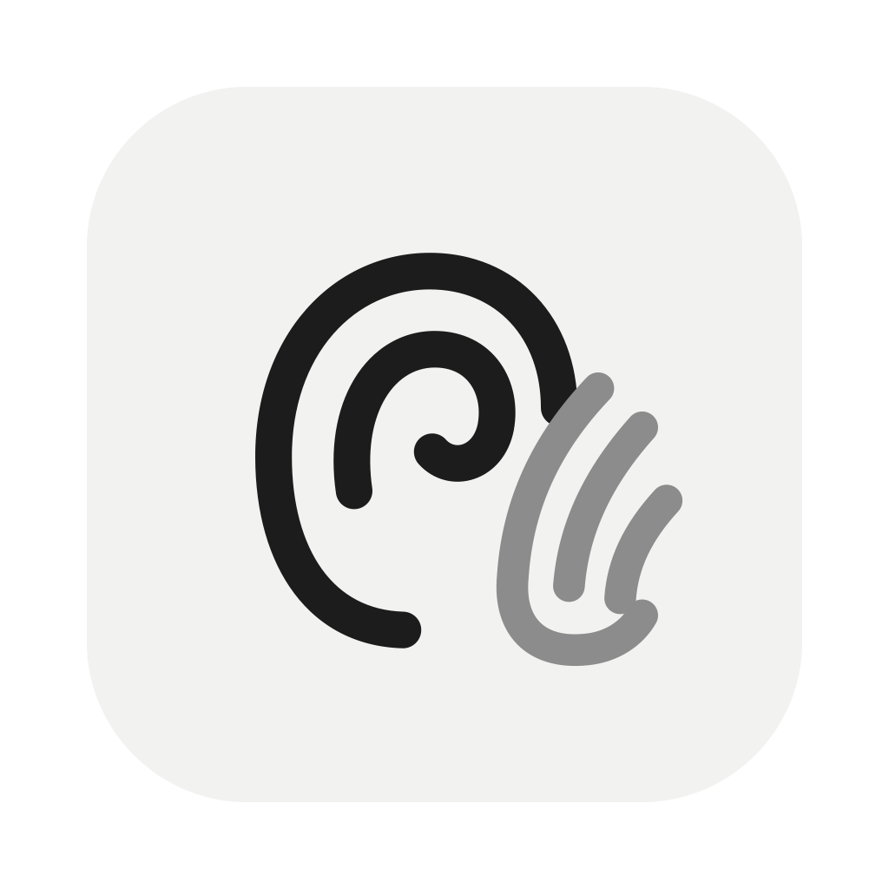

<p align="center"></p>

# Kahana Fusi

Private, offline voice dictation for macOS. Hold a key, talk, let go, and clean text is pasted where your cursor is.

Everything runs on your Mac. Audio is never saved or uploaded.

- **Languages:** English, Hindi and Hinglish only. If a clip is detected as any other language, it's transcribed again as Hindi.
- **Long dictation:** 1,000–1,500+ words in one go. Silences are removed before transcription, and cleanup runs in parallel on ~150-word chunks.
- **Learns from you:** your corrections become dictionary rules that are applied to every future dictation.

## How it works

```
Hold Right ⌥ → mic records in memory
  → Silero VAD removes the pauses
  → whisper-server (kept loaded, so there's no startup delay) turns speech into text, guided by your dictionary
  → Ollama llama3.2 cleans ~150-word chunks in parallel: fillers, stutters, "5, no, 6" → "6", pauses → sentence breaks
  → your correction rules are applied
  → pasted into the focused app
```

## Requirements

- macOS on Apple Silicon (Intel works but runs slower)
- [Homebrew](https://brew.sh)
- About 3 GB of free disk space for the models

## Install

```bash
git clone https://github.com/Harshjain007/kahana-fusi.git
cd kahana-fusi
./install.sh
```

`install.sh` installs `node`, `whisper-cpp` and `ollama` if they're missing. It downloads the models, runs `npm install`, and builds **Kahana Fusi.app** into `/Applications`. You can run it again safely because it skips anything already there.

## Run

Open **Kahana Fusi** from `/Applications` or Spotlight. It's a standalone app, so you don't need a terminal.

1. On first launch, allow **Microphone**.
2. Go to System Settings → Privacy & Security → **Accessibility**, turn on **Kahana Fusi**, then quit and reopen the app. Accessibility is needed for the hotkey and for pasting.
3. The ear-and-hand icon appears in the menu bar. Put your cursor in any text field, **hold Right Option**, speak, and release.

To start it automatically, go to System Settings → General → Login Items and add Kahana Fusi.

For development, run `npm start` to use the code directly. Then run `npm run build-app` to rebuild and reinstall the .app. After each rebuild, macOS may ask for Accessibility permission again. If so, turn it off and on.

## The app window

Click the menu-bar icon, then **Open Kahana Fusi**. The window opens on launch too.

- **History:** every dictation, newest first and grouped by day. Each entry shows the cleaned text and, under *What you said*, the raw transcript. You can search, copy, or **edit the text and press Save & learn**. The changed words become a rule, for example `chetna sanghatan => Chetna Sangathan`, that is applied to every future dictation and helps speech recognition hear that word.
- **Dictionary:** names and terms you use, plus your `wrong => right` rules. You can edit it directly.
- **Models:** which models are running for speech, silence detection and cleanup, and whether each runs on this Mac or in the cloud.

Everything is stored in `~/Library/Application Support/kahana-fusi/` (`history.jsonl` and `dictionary.txt`) and never leaves your Mac. Start the app with `HISTORY=off` to stop saving history.

You can start a new dictation while the previous one is still being processed. Dictations are always pasted in the order you spoke them.

## Where the models are stored

| Model | Purpose | Location | Size |
|---|---|---|---|
| Whisper large-v3-turbo (q5_0) | Speech → text | `~/.kahana-fusi/models/ggml.bin` | ~550 MB |
| Silero VAD | Removes silences | `~/.kahana-fusi/models/vad.bin` | ~1 MB |
| llama3.2:3b | Text cleanup | `~/.ollama/models` (managed by Ollama) | ~2 GB |

To remove them, run `rm -rf ~/.kahana-fusi` and `ollama rm llama3.2:3b`.

## Configuration (environment variables)

| Variable | Default | Options |
|---|---|---|
| `CLEANUP` | `ollama` | `ollama` (local), `none` (raw transcript) |
| `OLLAMA_MODEL` | `llama3.2:3b` | Any model you've pulled, e.g. `qwen2.5:7b` for better cleanup |
| `WHISPER_MODEL` | `~/.kahana-fusi/models/ggml.bin` | Path to any whisper.cpp `ggml-*.bin` |
| `HISTORY` | on | `off` to stop saving the local history |

Example: `CLEANUP=none npm start`

These variables apply when you run the app with `npm start`.

For better cleanup of long dictations, run `ollama pull qwen2.5:7b` and start the app with `OLLAMA_MODEL=qwen2.5:7b`. Output quality improves, but cleanup is about 2× slower.

## Troubleshooting

- **Nothing happens when I hold the key:** Accessibility permission is missing. Grant it, then restart the app.
- **Text isn't pasted:** same fix. The app pastes by simulating ⌘V.
- **The text is raw, with no cleanup:** Ollama isn't running. Start it with `ollama serve`.
- **Why not the Fn key?** macOS doesn't let apps capture Fn on its own. To use a different key, change `HOTKEY` in `main.js`.

## Publishing to GitHub (for the maintainer)

The models are **not** stored in the repo because they're too large. Users download them to `~/.kahana-fusi/models` with `install.sh`.

```bash
cd kahana-fusi
git init && git add . && git commit -m "Initial commit"
gh repo create kahana-fusi --public --source=. --push
```

Without the `gh` CLI: create an empty repo on github.com, then run `git remote add origin <url> && git push -u origin main`.

## Project layout

```
main.js      hotkey, whisper-server, language lock, chunked cleanup, learning, paste
preload.js   bridge between the windows and main
index.html   the "Listening…" pill and mic capture
app.html     main window: History, Dictionary, Models
assets/     logo (logo.svg), app icon, menu-bar icon
Info.plist   mic permission text; runs as a menu-bar-only app
install.sh   one-shot installer (tools + models + /Applications app)
```

## License

MIT
